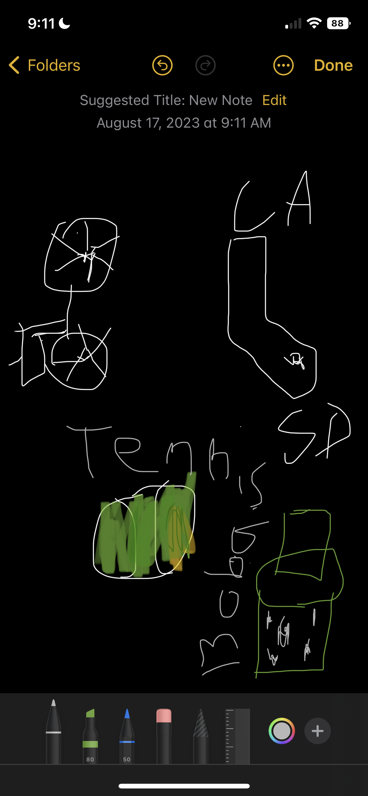
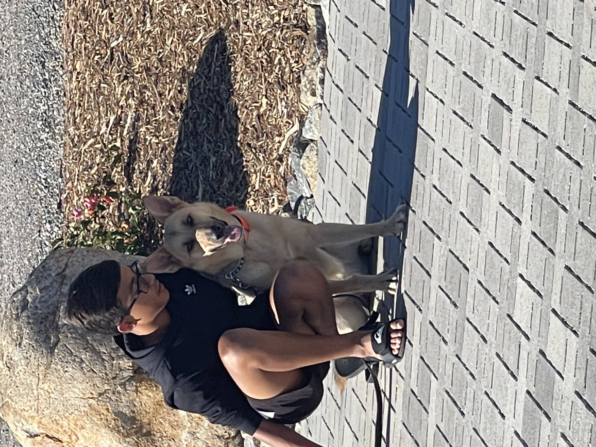

## Tarun's Page

## About Me

My name is Tarun and I am a sophmore at Del Norte High School. Things I like to do include coding, playing tennis, playing video games, and hanging out with friends. The classes I am taking this trimester include: AP Computer Science, AP Chemistry, World History 1, AP Calculus AB, and Spanish 3.

## Picture of me (and my dog)

## My Class Schedule

| Period      | Class |
| ----------- | ----------- |
|1    | AP Computer Science       |
|2    | AP Chemistry        |
|3    | World History 1        |
|4    | AP Calculus AB        |
|5    | Spanish 3        |

## Go to My Page:

Go to my [Github account](https://github.com/Djxnxnx){:target="_blank"}

from IPython.display import display, HTML
html_code = “”"

